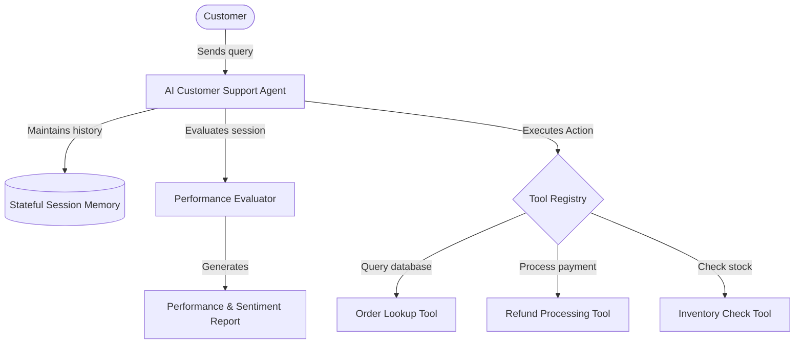

# ⚡ AI Customer Support Agent

[](LICENSE)
[](https://www.python.org/)
[](https://platform.openai.com/)
[](https://github.com/psf/black)

A production-ready, state-of-the-art AI Customer Support Agent system built using **OpenAI AgentKit**. This agent automates multi-step customer support workflows, processes structured actions (such as order lookup, refund handling, and inventory validation), maintains stateful conversational history, and tracks agent performance and customer sentiment in real time.

---

## 🎯 Key Features

Our support agent is designed with enterprise-grade capabilities to deliver a high-quality user experience and streamline operations:

* **🤖 Dynamic AI Reasoner** – Uses state-of-the-art LLMs (e.g., `gpt-4o`) coupled with OpenAI AgentKit for precise intent classification and multi-step reasoning.
* **🔧 Core Integrated Tools** – Out-of-the-box tools for e-commerce, including:
  * 📦 **Order Lookup:** Retrieves real-time status and tracking details.
  * 💳 **Refund Processing:** Handles refund requests dynamically with policy guards.
  * 🗃️ **Inventory Check:** Confirms stock availability before recommending replacements.
* **🧠 Stateful Conversation Memory** – Retains customer context across turns for personalized responses.
* **📊 Sentiment & Performance Monitoring** – Evaluates sentiment changes and token usage to output actionable performance reports.
* **🛡️ Fail-safe Fallbacks** – Graceful error resolution, retry policies, and human-handoff triggers.

---

## 🗺️ System Architecture



---

## 📂 Project Structure

```bash
Ai-Customer-Support-Agent/
├── src/
│   └── customer_service_agent/   # Core package implementation
│       ├── agent.py              # Main Agent logic
│       ├── tools.py              # Customer service tools & registry
│       ├── evaluator.py          # Sentiment & performance evaluator
│       ├── models.py             # Pydantic data schemas
│       └── utils.py              # Helper utilities
├── tests/                        # Test suite (pytest)
├── examples/                     # Ready-to-run code examples
├── notebooks/                    # Interactive Jupyter notebooks for analysis
├── docs/                         # Detailed usage, api, and deployment guides
└── scripts/                      # Setup and demonstration scripts
```

---

## 🚀 Quick Start

### 1. Prerequisites
Ensure you have **Python 3.8+** installed on your system.

### 2. Setup Repository & Dependencies
```bash
# Clone the repository
git clone https://github.com/Anshika-111105/Ai-Customer-Support-Agent.git
cd Ai-Customer-Support-Agent

# Create and activate virtual environment
python -m venv venv
source venv/bin/activate  # On Windows: venv\Scripts\activate

# Install dependencies
pip install -r requirements.txt
```

### 3. Configure Environment Variables
Copy the template `.env.example` file and configure your API credentials:
```bash
cp .env.example .env
```
Open `.env` and configure your OpenAI access key:
```env
OPENAI_API_KEY=your-api-key-here
```

### 4. Run the Demonstration
Execute the demo script to see the agent interact with sample scenarios (e.g. checking orders, analyzing sentiment):
```bash
python scripts/run_demo.py
```

---

## 💻 Usage Example

Integrating the AI Support Agent into your workflow is simple:

```python
from customer_service_agent import CustomerServiceAgent, AgentConfig

# Initialize agent with configuration
config = AgentConfig(
    model="gpt-4o",
    temperature=0.2
)
agent = CustomerServiceAgent(config=config)

# Start a stateful support conversation
response = agent.chat(
    message="Can you check if order ORD-99881 is shipped yet?",
    customer_id="CUST-4501"
)

print(f"Agent response:\n{response}")
```

---

## 📈 Monitoring & Quality Assurance

To ensure service quality, every interaction tracks sentiment, speed, and accuracy:

```python
# Generate a real-time analytics report
performance_report = agent.get_performance_report()
print(performance_report)
```

---

## 🔧 Development & Testing

We enforce strict linting, styling, and comprehensive tests to ensure reliability:

* **Run Tests:**
  ```bash
  venv/Scripts/python -m pytest
  ```
* **Format Code:**
  ```bash
  black src/ tests/
  ```
* **Type Safety:**
  ```bash
  mypy src/
  ```

---

## 📄 License
Distributed under the MIT License. See [LICENSE](LICENSE) for more information.

## 🆘 Support & Resources
* 📚 [Documentation Guides](docs/)
* 🐛 [Issues & Bug Reports](https://github.com/Anshika-111105/Ai-Customer-Support-Agent/issues)
* 💬 [Community Discussions](https://github.com/Anshika-111105/Ai-Customer-Support-Agent/discussions)
